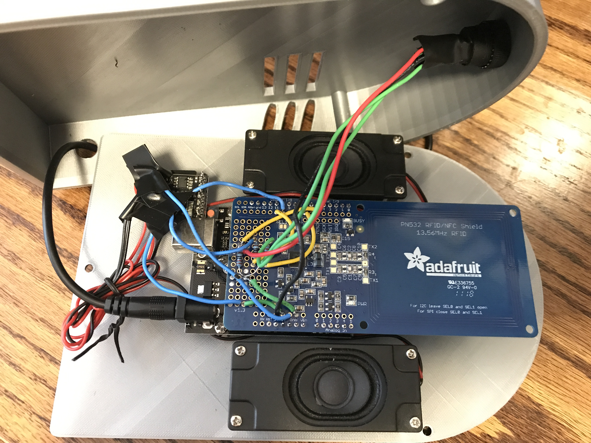
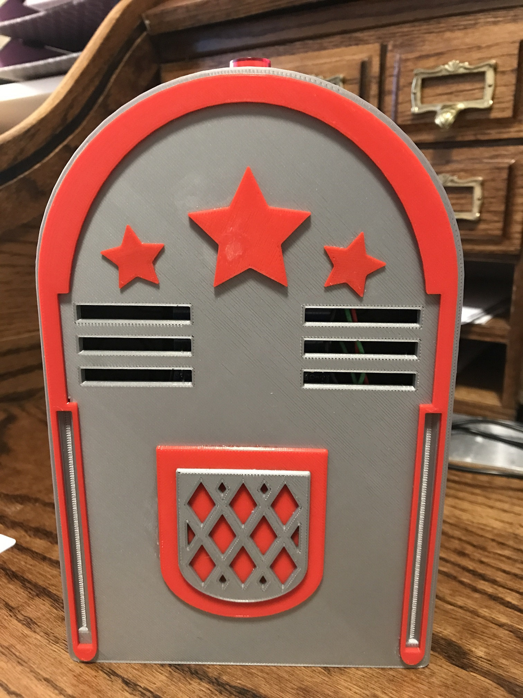

# Arduino NFC Jukebox

Recently, my wife and I had the idea of printing a song card for our 16 month old daughter. What this means is there are pictures printed on some cardstock which she can point to, and one of us sings the songs represented by that picture. 

After a few days of continuous singing, I decided to build a jukebox for her instead. I wanted to enable simple song selection using NFC cards with feedback from an LED. I also wanted to introduce her to the concept of sequences, while allowing her some simple level of control using a button. Finally, I would also need a way to change volume and other control functions.

This is a quick walkthrough for anyone who might like to do the same.

## Components

| Part               | Link | Cost |
| -------------------|------|------|
| NTAG 215 NFC cards | [Amazon](https://www.amazon.com/gp/product/B075CL71FK/ref=ppx_yo_dt_b_asin_title_o01__o00_s00?ie=UTF8&psc=1) | ~60c ea |
| NTAG 213 NFC tags | [Amazon](https://www.amazon.com/gp/product/B07K6H6K43/ref=ppx_yo_dt_b_asin_title_o05__o00_s03?ie=UTF8&psc=1) | ~40c ea |
| DFPlayer mini | [Amazon](https://www.amazon.com/gp/product/B01MQD5IIA/ref=ppx_yo_dt_b_asin_title_o03__o00_s00?ie=UTF8&psc=1) | ~$4 |
| Power supply | [Amazon](https://www.amazon.com/gp/product/B06Y1LF8T5/ref=ppx_yo_dt_b_asin_title_o03__o00_s00?ie=UTF8&psc=1) | ~$9 |
| Illuminated latching switch | [Adafruit](https://www.adafruit.com/product/1442) | ~$2 |
| 3W speakers | [Amazon](https://www.amazon.com/gp/product/B0738NLFTG/ref=ppx_yo_dt_b_asin_title_o08__o00_s02?ie=UTF8&psc=1) | ~$8 |
| PN532 NFC shield | [Adafruit](https://www.adafruit.com/product/789) | ~$40 |
| Arduino Uno R3 | [Amazon](https://www.amazon.com/Elegoo-EL-CB-001-ATmega328P-ATMEGA16U2-Arduino/dp/B01EWOE0UU/ref=sr_1_5?ie=UTF8&qid=1549670064&sr=8-5&keywords=arduino+uno) | ~$12 |
| Sandisk microSDHC card | [Amazon](https://smile.amazon.com/gp/product/B073JWXGNT/ref=oh_aui_search_asin_title?ie=UTF8&psc=1) | ~8 |

You will also need:

- Assorted brass standoffs
- Solid core wire
- Electrical insulation tape
- 8x M2 3mm screws (for speaker mounts)
- 4x M2 3mm screws (for Arduino mounts)
- 3x M2.5 3mm screws (for enclosure)
- 3x 2.5mm hex nuts (for enclosure)
- Soldering iron and solder
- MP3 songs

Total cost: ~$100

## Case

I designed the outer case and trim using Tinkercad, and printed in two colors. You can find all those parts here:

- [Back](case/01%20-%20grey%20-%20back.stl)
- [Front](case/02%20-%20grey%20-%20front.stl)
- [Trim, grey](case/03%20-%20grey%20-%20decoration.stl)
- [Trim, red](case/04%20-%20red%20-%20decoration.stl)

## Control tags

I found these handy key fobs on Thingiverse, which I used to represent control tags:

- [volume Up](https://www.thingiverse.com/thing:2852132)
- [volume Down](https://www.thingiverse.com/thing:2852051)
- [Stop](https://www.thingiverse.com/thing:2852109)

50% was a good size for these prints. 

## Music

I purchased songs through iTunes, then converted the m4a files to mp3 directly using the iTunes app. These were copied over to the SD card according to this structure:

```
\01
    \0001.mp3
    \0002.mp3
    ...
    \0010.mp3
    \0011.mp3
    ...
```

Note the root folder is a 2-digit number, and the files are all 4-digit zero-prefixed. This is a requirement for the DFPlayer Mini. The numbering also makes it simpler to map the individual cards to songs.

## Writing tags and cards

Once the headers are soldered to the NFC shield, you can use the [nfcWriter](src\jukebox.ino) to write an integer to each card. This integer must map to the file number of the song you want to select with that card. In other words, write `4` to the card to play `01\0004.mp3`. 

I used control tags for volume up, volume down, and stop. For these I selected `97`, `98`, and `99` as control codes, which were written to NFC tag stickers, and I attached those to little key fobs which I printed. 

## Circuit diagram

TBD

## Assembly

1. Print all the case parts; glue trim to the front case
1. Print the key fobs, if you plan on using them
1. Solder the NFC shield headers
1. Solder solid core wires to the button; wrap with electrical insulation tape
1. Mount the button in the front case
1. Solder solid core wires to the DFPlayer; wrap with insulation tape
1. Solder the DFPlayer wires and resistors to the NFC shield as per the circuit diagram above
1. Mount the Arduino and speakers to the back case using standoffs
1. Mount the NFC shield on the Arduino board
1. Solder the button wires to the NFC shield as per the circuit diagram above
1. Place two small hex nuts in the case, which will catch the screws
1. Insert the SD card, connect power supply through the case, and screw the case closed
1. Decorate with stickers and mount :P

## Final result






## Notes

There are a few things I would change if I was doing this again:

1. Given the way the button is mounted to the front case, the soldering was a bit fiddly. I would either modify the case so that the button was mounted to the back case, or use alligator clips to attach the wires to the button connectors. 

1. The DFPlayer in my build was not mounted anywhere, and I did not make an opening to get access to the SD card. This means when I want to add more songs I need to open the case. Since I only have one NFC shield which doubles as a card writer and the jukebox reader, I had to open the case anyway. However, this could be improved.